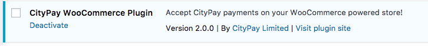

[](https://www.codacy.com/app/CityPay/citypay-paylink-woo-commerce?utm_source=github.com&amp;utm_medium=referral&amp;utm_content=citypay/citypay-paylink-woo-commerce&amp;utm_campaign=Badge_Grade)

CityPay Paylink WooCommerce Plugin
==================================


 


CityPay Paylink WooCommerce is a plugin that supplements WooCommerce with
support for payment processing using CityPay hosted payment forms and Paylink 3.

The WooCommerce plugin works by creating a token and redirecting to the
Paylink form for card holders to enter their card details directly into
the CityPay secure web application. Once a payment has been completed it
will attempt to connect via a webhook or postback to your web site.  

## Minimum requirements

* PHP version 5.2.4 or greater 
* MySQL version 5.0 or greater
* WordPress 4.0 or greater
* WooCommerce 3 or greater

## Automatic Installation

To perform an automatic installation of the CityPay Paylink WooCommerce plugin,
login to your WordPress dashboard, select the Plugins menu and click Add New.

In the search field, type "CityPay" and click Search Plugins. Once you have
found our payment gateway plugin, it may be installed by clicking Install Now.

## Manual installation

The perform a manual installation of the CityPay Paylink WooCommerce plugin,
login to your WordPress dashboard, select the Plugins menu and click Add New. 

Then select Upload Plugin, browse to the location of the ZIP file containing
the plugin (typically named *citypay-paylink-woocommerce.zip*) and then click
Install Now.

## Post installation: Plugin Settings 

Once the plugin has been installed, you may need to activate it by selecting
the Plugins menu, clicking Installed Plugins and then activating the plugin
with the name "CityPay WooCommerce Plugin" by clicking on the link labeled
Activate.



You will need to edit WooCommerce checkout settings by navigating to the 
WooCommerce administration panel, selecting WooCommerce, Settings and then 
the checkout tab. If installed correctly, you should see CityPay as a link
under the Checkout Options.

The merchant account, the licence key, the transaction currency and other
information relating to the processing of transactions through the CityPay
Paylink hosted form payment gateway may be configured by selecting the
plugin configuration form which is accessed indirectly through the
WooCommerce settings page upon selecting the Checkout tab, and clicking on
the link labeled CityPay which appears in the list of available payment
methods.

You can include the WooCommerce order identifier in the description sent
to CityPay for the purpose of including a customer-friendly reference in
the email sent to the customer. This is
achieved by specifying {order_id} as part of the descriptive text appearing
in the text box labeled Transaction Description.

After the settings for the plugin have been configured, they must be saved
by clicking on the button labeled Save Changes before they take effect.

### Developer Postback Testing

The Paylink service cannot send a postback/webhook to your localhost test server
to update the order status. Therefore token requests fail to be created when 
a localhost or local network address is detected in the postback URL. To work 
around this, we recommend using [https://ngrok.com](https://ngrok.com) to create
a secure tunnel to your localhost server. As your WordPress installation may be 
on localhost, the CityPay settings page allows the addition of a 
**Postback Site Address (URL)** which you can customise with your ngrok address i.e.
https://12345678abc.ngrok.io. The value should be the host and protocol part of the 
URL.
 

 
### Processing test transactions

To test the operation of an e-commerce solution based on WooCommerce in
combination with the CityPay Paylink WooCommerce plugin without processing
transactions that will be settled by the upstream acquirer, the check box
labeled Test Mode appearing on the plugin settings form should be ticked.

### Processing live transactions

To process live transactions for settlement by the upstream acquirer, the
check box labeled Test Mode referenced in the paragraph above must be
unticked.

### Enabling logging 

The interaction between WordPress, WooCommerce and the CityPay Paylink
hosted payment form service may be monitored by ticking the check box labeled
Debug Log appearing on the plugin settings form.

Log payment events appearing in the resultant log file will help to trace
any difficulties you may experience accepting payments using the CityPay
Paylink service.

The location of the log file is provided on the plugin settings form.

## Failure to Process to CityPay

We have added code to the plugin to feedback problems at the checkout to the end user
and as notes to the order. For instance if an invalid merchant id is supplied, the 
plugin will display

```
Unable to process to CityPay.
 - P003: Merchant ID Is Invalid
 ```
 
Likewise, on your order page, order notes will show the same problem

```
Unable to process to CityPay.
 - P003: Merchant ID Is Invalid
```

# Running WooCommerce in Docker

CityPay have created a `Dockerfile` which can be used to test WooCommerce and the 
CityPay plugin. 

The docker file is based on 
1. wordpress 4.9
2. php 7.1 running apache

The docker instance will run ngrok for postback testing and expose port 80 for web 
inspection.

As WordPress/WooCommerce requires a database, we have also created a `docker-compose.yml` file
which sets up:
1. a network called `wordpressnet`
2. a MySql database instance called *wordpress*
3. the latest instance of the citypay/wordpress docker file

You will need to setup an environment file `.env`, which should be located within the same 
directory as the *docker-compose.yml* file. The file should contain security related 
key name pairs 
```
WORDPRESS_DB_PASSWORD=********
MYSQL_ROOT_PASSWORD=******** <-- should be the same as WORDPRESS_DB_PASSWORD 
NGROK_AUTHTOKEN=...your authtoken for ngrok
```

 